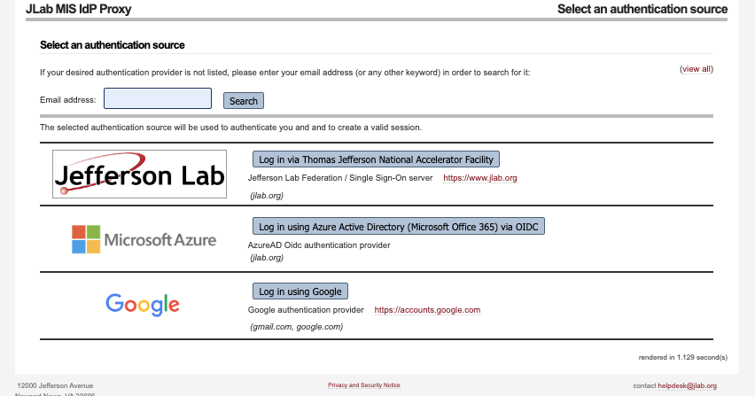

.. highlight:: shell

.. _gitlab:

GitLab @JLab
============
The JLab User Gitlab instance is available here: `<https://code.jlab.org/>`_ .

Login Procedure
---------------
Once you go to the site you will see the login page and select "Login with your institution Credentials" button.

Then you will land in following page:

|

The default permission and resource level depends which authentication method you choose on your first login.

1. JLab login (Everyone with an @jlab.org account should do this!)
    a. You will be automatically granted access to a number of Hall, Experiment, and/or Division GitLab groups based on your CUE unix group assignments.
    b. You will be automatically granted space to create and manage personal repositories.
    c. @jlab.org account holders are assigned additional privileges based on what JLab unix groups they are in when their GitLab account is initially created. 
       Additional permissions can be granted by emailing their `Compute Coordinator <https://jlab.servicenowservices.com/kb?id=kb_article_view&sysparm_article=KB0014686>`_ and explaining what they would like to do.

2. Other login:
    a. You will only have read only access to open/public projects.
    b. For anything else, someone would need to grant you privileges to the repositories. Please talk to your `Compute Coordinator <https://jlab.servicenowservices.com/kb?id=kb_article_view&sysparm_article=KB0014686>`_ .

.. note:: 
  To search for repos public or internal groups (that you are part of) please got to the `link <https://code.jlab.org/explore/groups>`_

Create/Import Projects
----------------------

Creating a New Project
^^^^^^^^^^^^^^^^^^^^^^

To create a new project:

1. Click on the "+" icon in the top navigation bar.
2. Select "New project/repository".
3. Choose "Create blank project" or select a template.
4. Fill in the project details:

   - Project name
   - Project URL: This determines where your project will be located in GitLab's structure.

        - Personal namespace: Projects created here will have a URL like `https://code.jlab.org/username/project-name`
        - Group namespace: If you're part of a group, you can create projects within that group. The URL will be `https://code.jlab.org/group-name/project-name`
        - Subgroup namespace: For more complex organizations, you can use subgroups. The URL structure would be `https://code.jlab.org/parent-group/subgroup/project-name`

   - Project slug (URL): This is a URL-friendly version of your project name, automatically generated from the project name but can be customized. It will be used in the project's URL and should be unique within the namespace.
   - Visibility level: This can ve changed later as well using  project settings -> General ( ## Visibility, project features, permissions) -> Project visibility

     - Private: Only project members can access
     - Internal: Any authenticated user can access
     - Public: Anyone can access (useful for open-source projects)
 
5. Click "Create project".

**Tips for choosing the right namespace:**

    - Personal projects are great for individual work or experiments.
    - Group projects are ideal for team collaborations or department-wide projects.
    - Consider your project's scope and who needs access when deciding on the namespace.
    - You can transfer projects between namespaces later if needed, but it's best to start in the right place.

Importing an Existing Project
^^^^^^^^^^^^^^^^^^^^^^^^^^^^^

1. Click on the "+" icon in the top navigation bar.
2. Select "New project/repository".
3. Choose "Import project".
4. Select the source of your project (e.g., GitHub, Bitbucket, repository URL and more).

Let's focus on importing from GitHub.

Importing from GitHub
"""""""""""""""""""""

To import a project from GitHub, you'll need to authenticate using a personal access token (PAT).

Using a Personal Access Token, first generate a GitHub personal access token:

   - Go to https://github.com/settings/tokens
   - Click "Generate new token (classic)"
   - Give your token a descriptive name
   - Select the following scopes:
     - `repo` (Full control of private repositories)
     - `read:org` (Read org and team membership, read org projects) (required if importing from organizational repositories)
   - Click "Generate token"
   - Copy the generated token (you won't be able to see it again)

5. Paste your GitHub personal access token
6. Click "List your GitHub repositories"
7. Select the repositories you want to import
8. For each repository, you can:
   - Change the target namespace (where it will be imported in GitLab)
   - Change the target repository name
   - Set the visibility level (Private, Internal, or Public)
9. Click "Import" to start the import process.

**Tips for a smooth import:**

  - Ensure your GitHub email address matches your GitLab email for proper author attribution
  - Large repositories may take some time to import
  - You can check the import status on the project page after starting the import

After the import is complete, you'll have a fully functional GitLab project with your GitHub repository's history, branches, and tags. Issues, pull requests, and wiki pages will also be imported if you selected those options.

JLab GitLab Limits
----------------------
Most of the settings for the JLab GitLab instance match the upstream defaults.
Examples are are documented here:

   - `Account and limit settings <https://docs.gitlab.com/ee/administration/settings/account_and_limit_settings.html>`_
   - `Instance limits <https://docs.gitlab.com/ee/administration/instance_limits.html>`_
   - `CI/CD limits <https://docs.gitlab.com/ee/administration/instance_limits.html#cicd-limits>`_

      - JLab GitLab Runner defaults are presently 4GiB RAM (max 24GiB); 2 threads (max 12)

          - See `KUBERNETES_MEMORY_LIMIT, KUBERNETES_CPU_* <https://docs.gitlab.com/runner/executors/kubernetes/#overwrite-container-resources>`_ variables

        Note that bigger numbers may mean that the runner takes longer to schedule.

   - `Number of files per Pages Website <https://docs.gitlab.com/ee/administration/instance_limits.html#number-of-files-per-gitlab-pages-website>`_ 
   - `Package registry limits <https://docs.gitlab.com/ee/administration/instance_limits.html#package-registry-limits>`_

